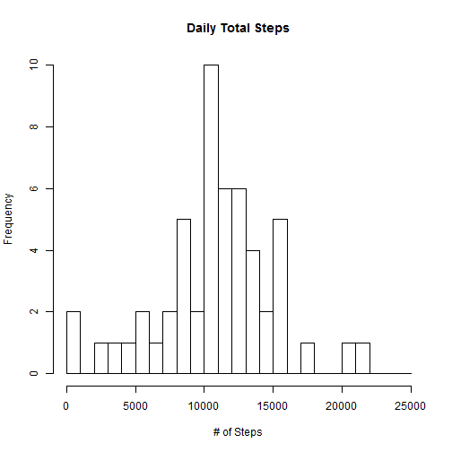
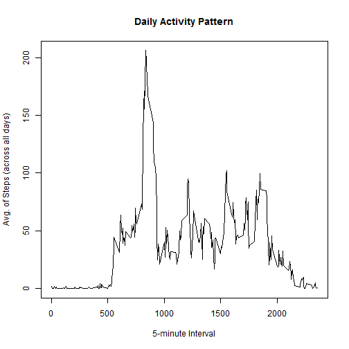
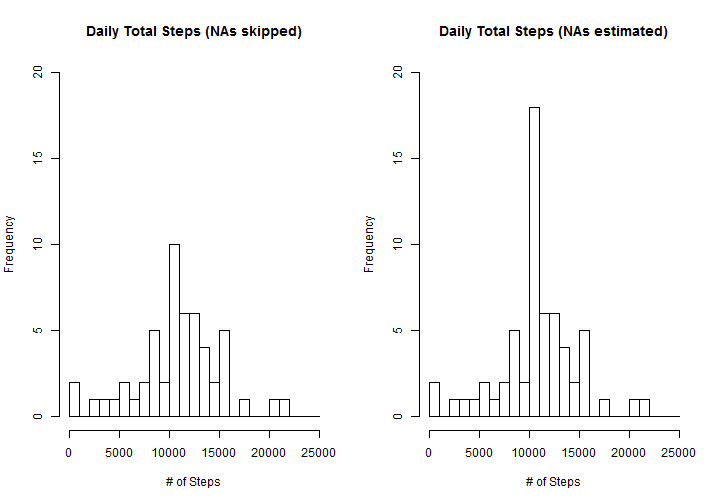

## Loading and preprocessing the data

```r
## Library calls and setting
library(knitr)
library(dplyr)
library(ggplot2)
library(xtable)
options(scipen = 999, digits = 0) ##No decimal (for steps)
```


```r
##Load data
unzip("activity.zip")
activity <- read.csv("activity.csv", header = TRUE, sep = ",")
act <- activity[!is.na(activity$steps),] ##Skip NA rows
##Aggregate by Date
stepsByDay <- group_by(act, date)
stepsByDaySum <- summarize(stepsByDay, steps = sum(steps))
##Histogram of daily total steps
hist(stepsByDaySum$steps, main = "Daily Total Steps", xlab = "# of Steps", breaks=c(seq(0, 25000, 1000)))
```

 

## What is mean total number of steps taken per day?

```r
stepsByDayMean <- mean(stepsByDaySum$steps)
stepsByDayMed <- median(stepsByDaySum$steps)
```
- The mean total number of steps taken per day: **10766**
- The median total number of steps taken per day: **10765**


## What is the average daily activity pattern?

```r
stepsByTime <- group_by(act, interval)
stepsByTimeAve <- summarize(stepsByTime, steps = mean(steps))

with(stepsByTimeAve, plot(interval, steps, main = "Daily Activity Pattern", ##xaxt="n",
     xlab = "5-minute Interval", ylab = "Avg. of Steps (across all days)", type = "l"))
```

 


```r
##Retrieve row for Max Step
maxStepInterval <- filter(stepsByTimeAve, steps == max(steps))
hour <- substr(maxStepInterval$interval, 1, nchar(maxStepInterval$interval) - 2)
min <- substr(maxStepInterval$interval, nchar(maxStepInterval$interval) - 1, nchar(maxStepInterval$interval))
```

- The most active time of the day is **8:35 (835 interval)** with **206** steps.

## Imputing missing values

```r
##Retrieve row count which is missing values
naRows <- nrow(activity[is.na(activity$steps),])
```
- Total number of missing values in the dataset (rows with NAs) is **2304**.
- Missing values are replaced with the average for the 5-minute interval.


```r
##Add a variable with the average of the interval
actNoNA <- merge(activity, stepsByTimeAve, by.x = "interval", by.y = "interval", all = FALSE, sort = FALSE)
##Add a variable which fills rows only with NAs with the average column added above
actNoNA <- mutate(actNoNA, steps_NoNA = ifelse(is.na(steps.x), steps.y, steps.x))
stepsByDayNoNA <- group_by(actNoNA, date)
stepsByDaySumNoNA <- summarize(stepsByDayNoNA, steps = sum(steps_NoNA))
```
Two histograms blow compares the total number of steps taken each day: Missing Values skipped (left) vs. Missing Values estimated (right).


```r
par(mfrow = c(1, 2))
hist(stepsByDaySum$steps, main = "Daily Total Steps (NAs skipped)", xlab = "# of Steps", 
     breaks=c(seq(0, 25000, 1000)), ylim = c(0, 20))
hist(stepsByDaySumNoNA$steps, main = "Daily Total Steps (NAs estimated)", xlab = "# of Steps", 
     breaks=c(seq(0, 25000, 1000)), ylim = c(0, 20))
lines(stepsByDaySumNoNA$steps, col="blue", lwd=2)
```

 

Calculate and report the mean and median total number of steps taken per day.

```r
stepsByDayMean <- c(NA_Skipped = mean(stepsByDaySum$steps), NA_Estimated = mean(stepsByDaySumNoNA$steps))
stepsByDayMed <- c(median(stepsByDaySum$steps), median(stepsByDaySumNoNA$steps))
xt <- rbind(stepsByDayMean, stepsByDayMed)
print(xt, type = "html")
```

```
##                NA_Skipped NA_Estimated
## stepsByDayMean      10766        10766
## stepsByDayMed       10765        10766
```
Even though imputing missing data created a new peak in the histogram, the overall mean **did not change**. The change in median is also **minimal**.

## Are there differences in activity patterns between weekdays and weekends?


```r
##Add a variable with two levels - weekday and weekend
actNoNAWk <- mutate(actNoNA,
     dayType = ifelse(weekdays(as.Date(date))=="Saturday" | weekdays(as.Date(date))=="Sunday", "weekend", "weekday"))

stepsByTimeWk <- group_by(actNoNAWk, dayType, interval)
stepsByTimeAveWk <- summarize(stepsByTimeWk, steps = mean(steps_NoNA))

g <- ggplot(stepsByTimeAveWk, aes(interval, steps))
g + geom_line() + facet_wrap(~ dayType, nrow = 2, ncol = 1)
```

 
